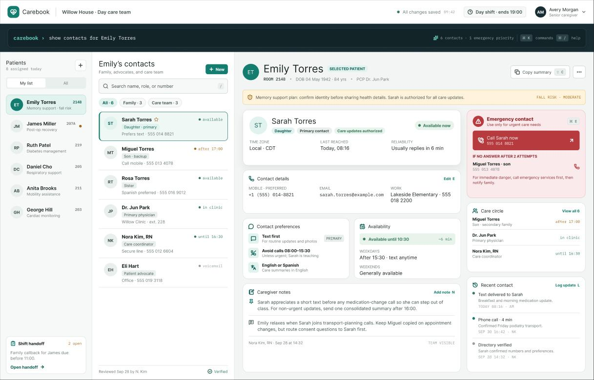

# CareBook

CareBook is a desktop, CLI-first contact management application for tech-comfortable in-house caregivers and healthcare administrators who manage contact details for patients and their families.

It gives caregivers a fast and reliable way to store and retrieve patient and family contact details, helping them reach the right person quickly during day-to-day care or an emergency.

## Key features

* Add a new contact.
* List all saved contacts.
* Delete an unwanted contact.
* View the full details of a specific contact.
* Save contact data automatically between sessions.

## Documentation

* [CareBook Product Website](https://ay2627s1-cs2103t-t08-1.github.io/tp/)
* [User Guide](docs/UserGuide.md)
* [Developer Guide](docs/DeveloperGuide.md)
* [About Us](docs/AboutUs.md)

## Acknowledgements

* This project is based on the [AddressBook-Level3](https://github.com/se-edu/addressbook-level3) project created by the [SE-EDU initiative](https://se-education.org).
* Libraries used: [JavaFX](https://openjfx.io/), [Jackson](https://github.com/FasterXML/jackson), and [JUnit 5](https://github.com/junit-team/junit5).
